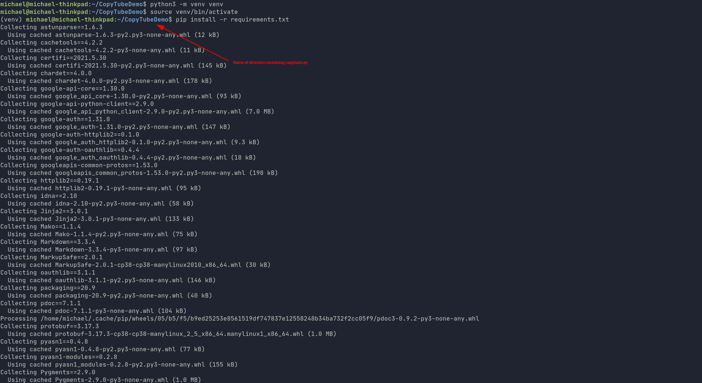

# Description

This script was created with the motivation of wanting to be able to add
DMCA free songs to an already existing public playlist of DMCA free songs for
use with streaming.  The downside of manually doing this process was having to
click *Add to Playlist* on each video in the existing playlist to be able to add
other songs I found I liked not already in the playlist.

The script was created using Python and YouTube's Data V3 API.

# Requirements
- Python 3.6+
- Pip
- YouTube API key and client_secrets file
    - Walkthrough for obtaining these credentials can be found [here](https://github.com/WilsonMJ/CopyTube/blob/30a3bb175067a7f6b95845605d051d758b95055f/youtube_api.md)
- Google account

# Configuration

1. Add API key and client_secrets filename to [config.py](https://github.com/WilsonMJ/CopyTube/blob/b7a1583398081e6bd9ed6d04eb03f0fc0492780d/config.py)
    - client_secrets file should be in the same directory as [copytube.py](https://github.com/WilsonMJ/CopyTube/blob/b7a1583398081e6bd9ed6d04eb03f0fc0492780d/copytube.py)

    

2. Set up a python virtual environment and activate
    - https://docs.python.org/3/tutorial/venv.html

3. Install modules needed using pip
    - `pip install -r requirements.txt`

    

# Usage

1. Start CopyTube
    - `python3 copytube.py`

    

2. Retrieve YouTube URL of playlist to be copied

    

3. Enter YouTube URL to prompt

    

4. Click on authorization link and log into the account of new playlist destination.
    - You will see a warning for the application being unverified.  Due to having set up the API client with your own credentials, you can click on *Advanced*, at which point you should see your email address, and click 
    *Go to CopyTube (unsafe)*

    

5. After clicking you will receive permission requests for CopyTube to be able to use your YouTube account. Click **Allow**, copy the authorization code provided, and paste into CopyTube's prompt.

    

    

    

6. A progress bar should appear showing the progress of the songs being copied
    - Upon finishing, the prompt will provide you with a link to the new playlist
    - If a 500 server error is sent, repeat steps 1 through 5.
    - Note that playlists exceeding 195 songs will be cut off at 195 and if multiple attempts have been made in one day the 195 limit will potentially be less

    

    

# Limitations

The biggest limitation for this script is the API quota limit.  YouTube
currently allows 10,000 quota units per day, and creating a new playlist and
inserting videos to a playlist are costly requests (50 quota units per request).

Another limitation to using this script is having to set up your own credentials
to use with the API.  I was unable to find a way to allow for a more easy setup
without exposing my API key and allowing unauthorized use to it.

A last issue that I have found to pop up occasionally is a 500 server error sent
by the API with little description as to the issue.  Upon rerunning the same
script the operations function properly.

