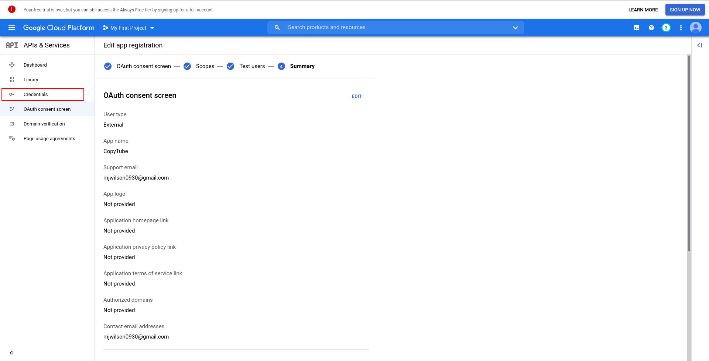

# Obtaining YouTube API Key and client_secrets JSON

1. Navigate to the [Cloud Console API Dashboard](https://console.cloud.google.com/apis/dashboard) and login with your Google account if needed.

2. Click on **ENABLE APIS AND SERVICES**

    

3. In the searchbox, search for **YouTube Data API V3** and click on the result

    

4. Click **Enable**

    

5. On the page you're redirected to, click on **Credentials**

    

6. Click on **CONFIGURE CONSENT SCREEN**. 
    - Your consent screen will need to be configured in order to obtain OAuth credentials for creating a playlist and adding videos to your account.

    

7. Choose **External** for User Type and click **CREATE**

    

8. Fill out the required information on this form indicated by the red asterisks and click **SAVE AND CONTINUE**.

    

    

9. For the **Scopes** page and **Test users** page, just click **SAVE AND CONTINUE**.
    
    

    

10. You will then arrive at the **OAuth consent screen** summary page. From here, click **Credentials**.

    

11. On the credentials page, click **CREATE CREDENTIALS** and select **API key**.
    - You have now generated the API key you should place in the **DEVELOPER KEY** variable found in [config.py](config.py)

    

    

12. Click **CREATE CREDENTIALS** again and select **OAuth client ID**.

    

13. For **Application type**, select **Desktop** and click **CREATE**.

    

14. Click **OK** on the screen that appears and click on the Download icon next to the newly created OAuth 2.0 Client ID.  Save this file into the same directory as [copytube.py](copytube.py).
    - Add the name of this file including .json to the **CLIENT_SECRETS_FILE** variable found in [config.py](config.py)

    

    

15. From the **Credentials** screen, click on **OAuth consent screen**.

    

16. On the **OAuth consent screen** page under **Publishing status**, click **PUBLISH APP** and **CONFIRM**.

    

    

15. You have now obtained all the necessary credentials to use CopyTube and setup the API for use with your google accounts!